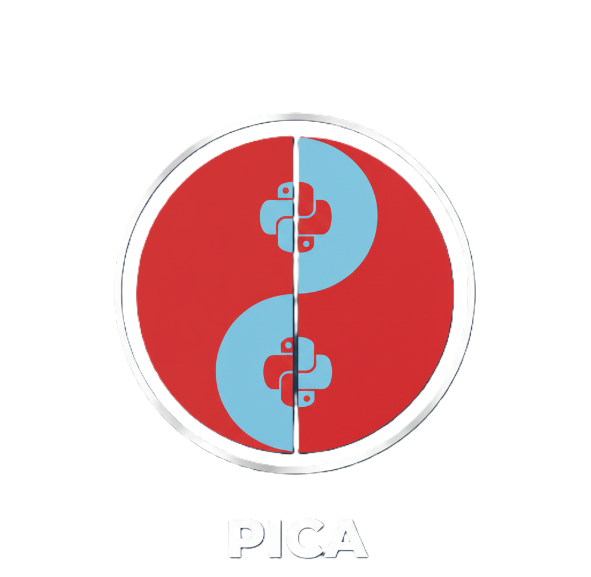
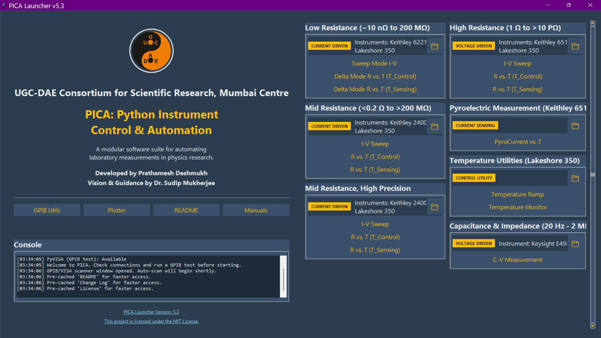

<div align="center">
  
  <h1>PICA: Python-based Instrument Control and Automation</h1>
  <p>A modular software suite for automating laboratory measurements in physics research.</p>
  
  <p>
    <a href="https://opensource.org/licenses/MIT"></a>
    <a href="https://www.python.org/downloads/"></a>
    <a href="#"></a>
  </p>
  <p>
    <a href="https://github.com/prathameshnium/PICA-Python-Instrument-Control-and-Automation"></a>
    <a href="https://github.com/prathameshnium/PICA-Python-Instrument-Control-and-Automation"></a>
    <a href="https://github.com/prathameshnium/PICA-Python-Instrument-Control-and-Automation/stargazers"></a>
    <a href="https://github.com/prathameshnium/PICA-Python-Instrument-Control-and-Automation/network/members"></a>
  </p>
  <p>
    
  </p>
</div>

---

## Overview

**PICA (Python-based Instrument Control and Automation)** is a software suite designed to provide a robust framework for automating laboratory instruments in materials science and condensed matter physics research. The suite features a central graphical user interface (GUI), the **PICA Launcher**, which serves as a dashboard for managing and executing a variety of characterization experiments.

A key architectural feature is the use of isolated process execution for each measurement module via Python's `multiprocessing` library, ensuring high stability and preventing inter-script conflicts. This platform is built to streamline data acquisition, enhance experimental reproducibility, and accelerate research workflows.

PICA is designed with a clear separation between the user interface (frontend) and the instrument control logic (backend). This modular approach makes the system easy to maintain, extend, and debug.

<div align="center">
    
</div>

---

## Architecture

The core design philosophy of PICA is the separation of concerns, implemented through a distinct **Frontend-Backend** architecture for each measurement module.

-   **Frontend:** Each measurement has a dedicated GUI script (e.g., `IV_K2400_Frontend_v5.py`) built with `Tkinter` and the `CustomTkinter` library. It is responsible for all user interaction, parameter input, and data visualization (live plotting). It runs in the main process.

-   **Backend:** The instrument control logic is encapsulated in a separate class (e.g., `Keithley2400_Backend`). This class handles all `PyVISA` communication, instrument configuration, and data acquisition commands.

-   **Process Isolation:** When a measurement is started, the frontend launches its corresponding backend logic in a separate, isolated process using Python's `multiprocessing` library. This is the key to PICA's stability: a crash or error in one measurement script will not affect the main launcher or any other running experiments.

-   **Communication:** The frontend and backend communicate via `multiprocessing.Queue` for thread-safe data exchange. The backend performs a measurement and places the data into a queue, which the frontend then reads to update plots and save to a file.

## Table of Contents

- [Core Features](#core-features)
- [Tech Stack & Dependencies](#tech-stack--dependencies)
- [Available Measurement Modules](#available-measurement-modules)
- [Instrument Specifications](#instrument-specifications)
- [Getting Started](#getting-started)
  - [Prerequisites](#prerequisites)
  - [Installation Steps](#installation-steps)
- [Resources & Documentation](#resources--documentation)
- [Contributing](#contributing)
- [Authors & Acknowledgments](#authors--acknowledgments)
- [License](#license)

---

## Core Features

- **Centralized Control Dashboard:** A comprehensive GUI for launching all measurement modules.
- **Isolated Process Execution:** Each script operates in a discrete process, guaranteeing application stability and preventing resource conflicts.
- **Integrated VISA Instrument Scanner:** An embedded utility for discovering, identifying, and troubleshooting GPIB/VISA instrument connections.
- **Modular Architecture:** Each experimental setup is encapsulated in a self-contained module with direct access to its scripts and data directories.
- **Embedded Documentation:** In-application viewer for essential project documentation, such as the README and software license.
- **System Console Log:** A real-time log provides status updates, confirmations, and error diagnostics for all operations.

---

## Tech Stack & Dependencies

The core of PICA is built with a stack of robust and widely-used Python libraries.

<p align="center">
  <a href="https://www.python.org/"></a>
  <a href="https://github.com/TomSchimansky/CustomTkinter"></a>
  <a href="https://pyvisa.readthedocs.io/en/latest/"></a>
  <a href="https://numpy.org/"></a>
  <a href="https://pandas.pydata.org/"></a>
  <a href="https://matplotlib.org/"></a>
</p>

- **Primary Language:** **Python 3.9+**
- **Graphical User Interface:** **Tkinter** (via the **CustomTkinter** library for a modern look and feel)
- **Instrument Communication:** **PyVISA** (a Python wrapper for the NI-VISA library)
- **Numerical Operations:** **NumPy**
- **Data Structuring:** **Pandas**
- **Data Visualization:** **Matplotlib**
- **Concurrency:** **Multiprocessing** (a native Python library for process isolation)

All required packages are listed in the `requirements.txt` file for easy one-step installation.

---

## Available Scripts & Modules

The PICA suite is organized into modules, each containing a frontend GUI application and its corresponding backend logic for instrument control.

#### Low Resistance (Keithley 6221 / 2182)
*   **Delta Mode I-V Sweep**
    *   **Frontend:** `Delta_mode_Keithley_6221_2182/IV_K6221_DC_Sweep_Frontend_V10.py`
    *   **Backend:** `Delta_mode_Keithley_6221_2182/Backends/Delta_K6221_K2182_Simple_v7.py`
*   **Delta Mode R vs. T (Active Control)**
    *   **Frontend:** `Delta_mode_Keithley_6221_2182/Delta_RT_K6221_K2182_L350_T_Control_Frontend_v5.py`
    *   **Backend:** `Delta_mode_Keithley_6221_2182/Backends/Delta_K6221_K2182_Simple_v7.py`
*   **Delta Mode R vs. T (Passive Sensing)**
    *   **Frontend:** `Delta_mode_Keithley_6221_2182/Delta_RT_K6221_K2182_L350_Sensing_Frontend_v5.py`
    *   **Backend:** (Internal to Frontend)

#### Mid Resistance (Keithley 2400)
*   **I-V Sweep**
    *   **Frontend:** `Keithley_2400/IV_K2400_Frontend_v5.py`
    *   **Backend:** `Keithley_2400/Backends/IV_K2400_Loop_Backend_v10.py`
*   **R vs. T (Active Control)**
    *   **Frontend:** `Keithley_2400/RT_K2400_L350_T_Control_Frontend_v3.py`
    *   **Backend:** (Internal to Frontend)
*   **R vs. T (Passive Sensing)**
    *   **Frontend:** `Keithley_2400/RT_K2400_L350_T_Sensing_Frontend_v4.py`
    *   **Backend:** (Internal to Frontend)

#### Mid Resistance, High Precision (Keithley 2400 / 2182)
*   **I-V Sweep**
    *   **Frontend:** `Keithley_2400_Keithley_2182/IV_K2400_K2182_Frontend_v3.py`
    *   **Backend:** `Keithley_2400_Keithley_2182/Backends/IV_K2400_K2182_Backend_v1.py`
*   **R vs. T (Active Control)**
    *   **Frontend:** `Keithley_2400_Keithley_2182/RT_K2400_K2182_T_Control_Frontend_v3.py`
    *   **Backend:** (Internal to Frontend)
*   **R vs. T (Passive Sensing)**
    *   **Frontend:** `Keithley_2400_Keithley_2182/RT_K2400_2182_L350_T_Sensing_Frontend_v2.py`
    *   **Backend:** (Internal to Frontend)

#### High Resistance (Keithley 6517B)
*   **I-V Sweep**
    *   **Frontend:** `Keithley_6517B/High_Resistance/IV_K6517B_Frontend_v11.py`
    *   **Backend:** `Keithley_6517B/High_Resistance/Backends/IV_K6517B_Simple_Backend_v10.py`
*   **R vs. T (Active Control)**
    *   **Frontend:** `Keithley_6517B/High_Resistance/RT_K6517B_L350_T_Control_Frontend_v13.py`
    *   **Backend:** `Keithley_6517B/High_Resistance/Backends/IV_K6517B_L350_T_Control_Backend_v6.py`
*   **R vs. T (Passive Sensing)**
    *   **Frontend:** `Keithley_6517B/High_Resistance/RT_K6517B_L350_T_Sensing_Frontend_v14.py`
    *   **Backend:** (Internal to Frontend)

#### Pyroelectric Measurement (Keithley 6517B)
*   **PyroCurrent vs. T**
    *   **Frontend:** `Keithley_6517B/Pyroelectricity/Pyroelectric_K6517B_L350_Frontend_v4.py`
    *   **Backend:** `Keithley_6517B/Pyroelectricity/Backends/Pyroelectric_K6517B_Working_Backend_v10.py`

#### Capacitance (Keysight E4980A)
*   **C-V Measurement**
    *   **Frontend:** `LCR_Keysight_E4980A/CV_KE4980A_Frontend_v3.py`
    *   **Backend:** `LCR_Keysight_E4980A/Backends/CV_KE4980A_Simple_Backend_v10.py`

#### Temperature Utilities (Lakeshore 350)
*   **Temperature Ramp**
    *   **Frontend:** `Lakeshore_350_340/T_Control_L350_RangeControl_Frontend_v8.py`
    *   **Backend:** `Lakeshore_350_340/Backends/T_Control_L350_Simple_Backend_v10.py`
*   **Temperature Monitor**
    *   **Frontend:** `Lakeshore_350_340/T_Sensing_L350_Frontend_v4.py`
    *   **Backend:** (Internal to Frontend)

---

## Instrument Specifications

Here is a meticulously verified summary of the key measurement specifications for the instruments used in the PICA project. All values have been cross-referenced with the provided instrument manuals to ensure accuracy.

#### Keithley 6221 Current Source + 2182A Nanovoltmeter System (Low Resistance)
**Primary Use:** High-precision, low-resistance I-V and R-T measurements via **Delta Mode**.

| Parameter                 | Lower Limit                                       | Higher Limit    | Best Resolution                             |
| :------------------------ | :------------------------------------------------ | :-------------- | :------------------------------------------ |
| **Resistance**            | **~10 nΩ** (Practical limit set by system noise)  | **200 MΩ**      | **Derived** (from V/I in Delta Mode)        |
| **Current Source (6221)**   | **100 fA**                                        | **105 mA**      | **100 fA** (on the 2 nA range)              |
| **Voltage Measure (2182A)** | **1 nV**                                          | **100 V**       | **1 nV** (on the 10 mV range)               |
---

#### Keithley 2400 SourceMeter (Mid-Range Resistance)
**Primary Use:** Versatile four-probe I-V and R-T measurements for a broad range of materials.

| Parameter                      | Lower Limit (Source / Measure) | Higher Limit (Source / Measure) | Best Resolution (Source / Measure)   |
| :----------------------------- | :----------------------------- | :------------------------------ | :----------------------------------- |
| **Resistance**                 | **&lt; 0.2 Ω**                    | **&gt; 200 MΩ**                    | **100 µΩ** (on the 20Ω range)        |
| **Voltage**                    | **5 µV / 1 µV**                | **±210 V / ±210 V**             | **5 µV / 100 nV** (6.5-digit mode) |
| **Current**                    | **50 pA / 10 pA**              | **±1.05 A / ±1.05 A**           | **50 pA / 10 pA**                    |
#### Keithley 6517B Electrometer (High Resistance & Pyroelectric)
**Primary Use:** Characterizing highly insulating materials and measuring pyroelectric currents.

| Parameter                      | Lower Limit                               | Higher Limit                    | Best Resolution                                |
| :----------------------------- | :---------------------------------------- | :------------------------------ | :--------------------------------------------- |
| **Resistance**                 | **1 Ω**                                   | **&gt; 10 PΩ** ($10^{16}$ Ω)        | **Derived** (from I-measure)                   |
| **Current (Pyroelectric)**     | **10 aA** ($10 \times 10^{-18}$ A)         | **20 mA**                       | **10 aA**                                      |
| **Voltage**                    | **1 µV**                                  | **200 V**                       | **1 µV**                                       |
| **Charge**                     | **1 fC**                                  | **2 µC**                        | **10 fC**                                      |

---
#### Keysight E4980A Precision LCR Meter (C-V Measurements)
**Primary Use:** Capacitance-Voltage (C-V) and impedance characterization.

| Parameter            | Lower Limit                                | Higher Limit                               | Best Resolution                            |
| :------------------- | :----------------------------------------- | :----------------------------------------- | :----------------------------------------- |
| **Basic Accuracy**   | Varies with conditions                     | Varies with conditions                     | **0.05%** (under optimal conditions)       |
| **Frequency**        | **20 Hz**                                  | **2 MHz**                                  | **Tiered** (e.g., 0.01 Hz at low freq.)    |
| **DC Bias**          | **-40 V**                                  | **+40 V**                                  | **0.3 mV** (Requires Option 001)           |

---

#### Lake Shore 350 Temperature Controller
**Primary Use:** Precise temperature control and monitoring for temperature-dependent measurements.
| Sensor Type      | Lower Temp. Limit | Higher Temp. Limit | Best Resolution (Temp)     | Notes                                      |
| :--------------- | :---------------- | :----------------- | :------------------------- | :----------------------------------------- |
| **Diode (DT-670)** | **1.4 K**         | **500 K**          | **&lt; 0.1 mK**               | At cryogenic temperatures                  |
| **Platinum RTD**   | **14 K**          | **873 K**          | **&lt; 1 mK**                 | At cryogenic temperatures                  |

## Getting Started

### Prerequisites

1.  **Python:** Python 3.9 or newer is recommended.
2.  **NI-VISA Driver:** You must install the [National Instruments VISA Driver](https://www.ni.com/en/support/downloads/drivers/download.ni-visa.html) for your operating system. This is required for Python's `pyvisa` library to communicate with the instruments.

### Installation Steps
h
    git clone https://github.com/prathameshnium/PICA-Python-Instrument-Control-and-Automation.git
    cd PICA-Python-Instrument-Control-and-Automation
    ```

2.  **Create a Virtual Environment**
    Using a virtual environment is strongly recommended to avoid conflicts with other Python projects.
    ```bash
    # Create the virtual environment
    python -m venv venv
    
    # Activate the environment
    # On Windows:
    venv\Scripts\activate
    # On macOS/Linux:
    source venv/bin/activate
    ```

3.  **Install Dependencies**
    This project uses a `requirements.txt` file to manage all necessary packages.
    ```bash
    pip install -r requirements.txt
    ```

4.  **Launch the Application**
    Execute the main launcher script from the project's root directory.
    ```bash
    python PICA_v6.py
    ```

---

## Extending PICA: Adding a New Module

The modular architecture makes it straightforward to add support for new instruments or measurement types. Here is a simplified example of the required structure.

#### 1. Create a Backend Class

The backend class handles all direct communication with the instrument.

```python
# In a file like "MyInstrument/Backend.py"
import pyvisa
import time

class MyInstrument_Backend:
    def __init__(self):
        self.instrument = None
        self.rm = pyvisa.ResourceManager()

    def connect(self, visa_address):
        self.instrument = self.rm.open_resource(visa_address)
        print(f"Connected to: {self.instrument.query('*IDN?')}")

    def configure(self, voltage):
        self.instrument.write(f":SOURCE:VOLTAGE {voltage}")
        self.instrument.write(":OUTPUT ON")

    def measure(self):
        current = self.instrument.query(":READ?")
        return float(current)

    def disconnect(self):
        if self.instrument:
            self.instrument.write(":OUTPUT OFF")
            self.instrument.close()
```

#### 2. Create a Frontend GUI

The frontend provides the user interface and manages the measurement loop in a separate thread.

```python
# In a file like "MyInstrument/Frontend.py"
import tkinter as tk
from threading import Thread
from MyInstrument.Backend import MyInstrument_Backend

class MyInstrument_GUI(tk.Frame):
    def __init__(self, master=None):
        super().__init__(master)
        self.backend = MyInstrument_Backend()
        # ... (GUI widget setup: entries, buttons, plots) ...

    def start_measurement(self):
        # This method runs in a new thread to keep the GUI responsive
        self.backend.connect("GPIB0::1::INSTR")
        self.backend.configure(voltage=1.5)
        for _ in range(100):
            current = self.backend.measure()
            # Use a queue to send data back to the GUI for plotting
            # ...
        self.backend.disconnect()
```

#### 3. Integrate with the PICA Launcher

Finally, add the path to your new frontend script in `PICA_v6.py` and `Setup/Picachu.py` to make it accessible from the main dashboard.

---

## 📚 Resources & Documentation

#### Included Manuals
A collection of official instrument manuals and software library documentation is provided within the `/_assets/Manuals/` directory. These documents serve as valuable technical references.

#### Instrument Interfacing Guide
For a detailed guide on hardware setup, instrument configuration, and connection testing, please consult the **Python Instrument Interfacing Guide**.

---

## 🤝 Contributing
Contributions are welcome! If you have suggestions for improvements or want to add a new instrument module, please feel free to:
1.  Fork the repository.
2.  Create a new branch (`git checkout -b feature/YourFeature`).
3.  Commit your changes (`git commit -m 'Add some feature'`).
4.  Push to the branch (`git push origin feature/YourFeature`).
5.  Open a Pull Request.

Please open an issue first to discuss any major changes you would like to make.

---

## 🧑‍🔬 Authors & Acknowledgments

<div align="center">
  
</div>

- **Lead Developer:** **[Prathamesh Deshmukh](https://prathameshdeshmukh.site/)**
- **Principal Investigator:** **[Dr. Sudip Mukherjee](https://www.researchgate.net/lab/Sudip-Mukherjee-Lab)**
- **Affiliation:** *[UGC-DAE Consortium for Scientific Research, Mumbai Centre](https://www.csr.res.in/Mumbai_Centre)*

#### Funding
Financial support for this work was provided under SERB-CRG project grant No. CRG/2022/005676 from the Anusandhan National Research Foundation (ANRF), a statutory body of the Department of Science & Technology (DST), Government of India.

---

## License

This project is licensed under the terms of the MIT License. See the `LICENSE` file for full details.
