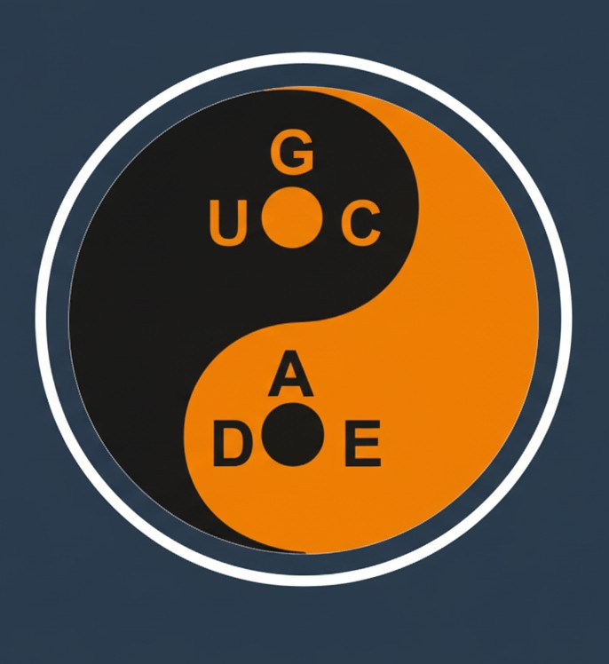

<div align="center">
  
  <h1>PICA: Python-based Instrument Control and Automation</h1>
  <p>A modular software suite for automating laboratory measurements in physics research.</p>
  
  <p>
    <a href="https://opensource.org/licenses/MIT"></a>
    <a href="https://www.python.org/downloads/"></a>
    <a href="#"></a>
  </p>
  <p>
    <a href="https://github.com/prathameshnium/PICA-Python-Instrument-Control-and-Automation"></a>
    <a href="https://github.com/prathameshnium/PICA-Python-Instrument-Control-and-Automation"></a>
    <a href="https://github.com/prathameshnium/PICA-Python-Instrument-Control-and-Automation/stargazers"></a>
    <a href="https://github.com/prathameshnium/PICA-Python-Instrument-Control-and-Automation/network/members"></a>
  </p>
  <p>
    
  </p>
</div>

---

## Overview

**PICA (Python-based Instrument Control and Automation)** is a software suite designed to provide a robust framework for automating laboratory instruments in materials science and condensed matter physics research. The suite features a central graphical user interface (GUI), the **PICA Launcher**, which serves as a dashboard for managing and executing a variety of characterization experiments.

A key architectural feature is the use of isolated process execution for each measurement module via Python's `multiprocessing` library, ensuring high stability and preventing inter-script conflicts. This platform is built to streamline data acquisition, enhance experimental reproducibility, and accelerate research workflows.

<div align="center">
    
</div>

---

## Table of Contents

- [Core Features](#core-features)
- [Tech Stack & Dependencies](#tech-stack--dependencies)
- [Available Measurement Modules](#available-measurement-modules)
- [Getting Started](#getting-started)
  - [Prerequisites](#prerequisites)
  - [Installation Steps](#installation-steps)
- [Resources & Documentation](#resources--documentation)
- [Contributing](#contributing)
- [Authors & Acknowledgments](#authors--acknowledgments)
- [License](#license)

---

## Core Features

- **Centralized Control Dashboard:** A comprehensive GUI for launching all measurement modules.
- **Isolated Process Execution:** Each script operates in a discrete process, guaranteeing application stability and preventing resource conflicts.
- **Integrated VISA Instrument Scanner:** An embedded utility for discovering, identifying, and troubleshooting GPIB/VISA instrument connections.
- **Modular Architecture:** Each experimental setup is encapsulated in a self-contained module with direct access to its scripts and data directories.
- **Embedded Documentation:** In-application viewer for essential project documentation, such as the README and software license.
- **System Console Log:** A real-time log provides status updates, confirmations, and error diagnostics for all operations.

---

## Tech Stack & Dependencies

The core of PICA is built with a stack of robust and widely-used Python libraries.

<p align="center">
  <a href="https://www.python.org/"></a>
  <a href="https://github.com/TomSchimansky/CustomTkinter"></a>
  <a href="https://pyvisa.readthedocs.io/en/latest/"></a>
  <a href="https://numpy.org/"></a>
  <a href="https://pandas.pydata.org/"></a>
  <a href="https://matplotlib.org/"></a>
</p>

- **Primary Language:** **Python 3.9+**
- **Graphical User Interface:** **Tkinter** (via the **CustomTkinter** library for a modern look and feel)
- **Instrument Communication:** **PyVISA** (a Python wrapper for the NI-VISA library)
- **Numerical Operations:** **NumPy**
- **Data Structuring:** **Pandas**
- **Data Visualization:** **Matplotlib**
- **Concurrency:** **Multiprocessing** (a native Python library for process isolation)

All required packages are listed in the `requirements.txt` file for easy one-step installation.

---

## Available Measurement Modules

The PICA suite includes modules for a range of standard electrical and thermal transport measurements.

| Instrument Combination         | Measurement Type                     | Description                                                                 |
| ------------------------------ | ------------------------------------ | --------------------------------------------------------------------------- |
| **Keithley 6221 / 2182A** | I-V Characterization (AC Delta)      | High-precision I-V sweeps for low-resistance samples.                       |
|                                | Resistance vs. Temperature (R-T)     | Automated R-T data acquisition with active or passive temperature profiles. |
| **Keithley 2400 SourceMeter** | Four-Probe I-V Characterization      | Standard I-V sweeps for materials like semiconductors.                      |
|                                | Four-Probe R-T Characterization      | Temperature-dependent resistance measurements.                              |
| **Keithley 2400 / 2182A** | High-Precision I-V                   | Enhanced voltage resolution using a nanovoltmeter.                          |
|                                | High-Precision R-T                   | Temperature-dependent measurements with enhanced voltage precision.         |
| **Keithley 6517B Electrometer**| High-Resistance I-V Characterization | For insulating materials, dielectrics, and high-impedance devices.          |
|                                | High-Resistance R-T                  | High-resistance measurements with active or passive temperature control.    |
|                                | Pyroelectric Current vs. Temperature | Quantifies pyroelectric current during a controlled temperature ramp.       |
| **Keysight E4980A LCR Meter** | Capacitance-Voltage (C-V) Sweeps     | Automated C-V measurements for semiconductor and dielectric analysis.       |
| **Lock-in Amplifier** | AC Resistance Measurement            | For measuring AC transport properties and contact impedance.                |
| **Lakeshore 340/350 Controller** | Temperature Control Utility          | A standalone module for defining and executing temperature profiles.        |
|                                | Temperature Monitoring Utility       | A passive data logger for monitoring environmental temperature.             |

---

## Getting Started

### Prerequisites

1.  **Python:** Python 3.9 or newer is recommended.
2.  **NI-VISA Driver:** You must install the [National Instruments VISA Driver](https://www.ni.com/en/support/downloads/drivers/download.ni-visa.html) for your operating system. This is required for Python's `pyvisa` library to communicate with the instruments.

### Installation Steps

1.  **Clone the Repository**
    ```bash
    git clone https://github.com/prathameshnium/PICA-Python-Instrument-Control-and-Automation.git
    cd PICA-Python-Instrument-Control-and-Automation
    ```

2.  **Create a Virtual Environment**
    Using a virtual environment is strongly recommended to avoid conflicts with other Python projects.
    ```bash
    # Create the virtual environment
    python -m venv venv
    
    # Activate the environment
    # On Windows:
    venv\Scripts\activate
    # On macOS/Linux:
    source venv/bin/activate
    ```

3.  **Install Dependencies**
    This project uses a `requirements.txt` file to manage all necessary packages.
    ```bash
    pip install -r requirements.txt
    ```

4.  **Launch the Application**
    Execute the main launcher script from the project's root directory.
    ```bash
    python PICA_Launcher_V5.py
    ```

---

## 📚 Resources & Documentation

#### Included Manuals
A collection of official instrument manuals and software library documentation is provided within the `/_assets/Manuals/` directory. These documents serve as valuable technical references.

#### Instrument Interfacing Guide
For a detailed guide on hardware setup, instrument configuration, and connection testing, please consult the **Python Instrument Interfacing Guide**.

---

## 🤝 Contributing
Contributions are welcome! If you have suggestions for improvements or want to add a new instrument module, please feel free to:
1.  Fork the repository.
2.  Create a new branch (`git checkout -b feature/YourFeature`).
3.  Commit your changes (`git commit -m 'Add some feature'`).
4.  Push to the branch (`git push origin feature/YourFeature`).
5.  Open a Pull Request.

Please open an issue first to discuss any major changes you would like to make.

---

## 🧑‍🔬 Authors & Acknowledgments

<div align="center">
  
</div>

- **Lead Developer:** **[Prathamesh Deshmukh](https://prathameshdeshmukh.site/)**
- **Principal Investigator:** **[Dr. Sudip Mukherjee](https://www.researchgate.net/lab/Sudip-Mukherjee-Lab)**
- **Affiliation:** *[UGC-DAE Consortium for Scientific Research, Mumbai Centre](https://www.csr.res.in/Mumbai_Centre)*

#### Funding
Financial support for this work was provided under SERB-CRG project grant No. CRG/2022/005676 from the Anusandhan National Research Foundation (ANRF), a statutory body of the Department of Science & Technology (DST), Government of India.

---

## License

This project is licensed under the terms of the MIT License. See the `LICENSE` file for full details.
