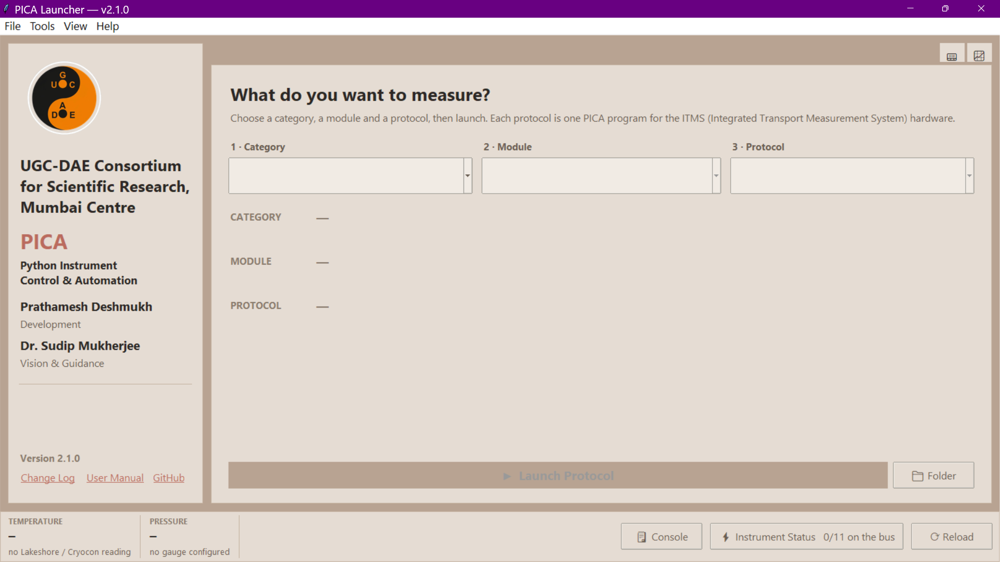
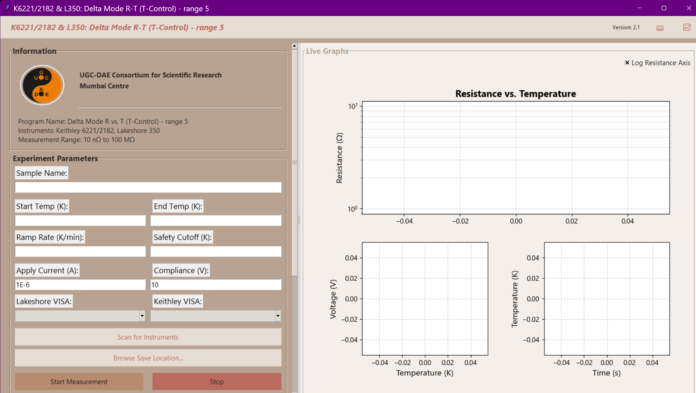

# PICA: Advanced High-Precision Transport Measurement Automation with Python

<p align="center">
  
</p>

<p align="center">
  <a href="https://github.com/prathameshnium/PICA-Python-Instrument-Control-and-Automation/actions/workflows/test.yml"></a>
  <a href="https://github.com/prathameshnium/PICA-Python-Instrument-Control-and-Automation/actions/workflows/lint.yml"></a>
  <a href="https://github.com/prathameshnium/PICA-Python-Instrument-Control-and-Automation/actions/workflows/codeql.yml"></a>
  <a href="https://github.com/prathameshnium/PICA-Python-Instrument-Control-and-Automation/actions/workflows/draft-pdf.yml"></a>
  <a href="https://codecov.io/gh/prathameshnium/PICA-Python-Instrument-Control-and-Automation"></a>
  
  <a href="LICENSE"></a>
  <br />
  <a href="docs/User_Manual.md"></a>
  <a href="CONTRIBUTING.md"></a>
  <a href="CODE_OF_CONDUCT.md"></a>
  <br />
  
  
  
  
  <a href="https://github.com/prathameshnium/PICA-Python-Instrument-Control-and-Automation/stargazers"></a>
  
  
  
</p>

---

## Overview

High precision low noise transport measurements are essential for advancing research in spintronics and materials characterization. **PICA (Python-based Instrument Control and Automation)** is a modular, open-source software suite designed to automate advanced transport measurements for electronic devices and chemical samples. It operates as a versatile framework capable of running on any standard laboratory workstation.

PICA provides an extensible, unified graphical user interface (GUI) for orchestrating high-precision instruments, specifically current source (DC/AC) units, nanovoltmeters, high resistance electrometers, impedance analyzers, and temperature controllers. Built on the robust Python scientific ecosystem, PICA ensures that the entire hardware ecosystem functions seamlessly as a cohesive unit.

The suite performs automated protocols including:
* Temperature-dependent wide-range resistance measurement ($10^{-8}$ - $10^{16}$ Ω).
* Current-voltage (I-V) characterization.
* Capacitance characterization and magnetocapacitance studies (20 Hz - 2 MHz).
* Pyroelectric current measurement (resolution $10^{-15}$ A).

<p align="center">
  
  <br>
  <em>PICA Launcher Interface for accessing all measurement modules.</em>
</p>

> **More details here:**
> For more information, go through the [User Manual](docs/User_Manual.md).

## Table of Contents

- [Overview](#overview)
- [Motivation](#motivation)
- [Key Features](#key-features)
- [Design and Implementation](#design-and-implementation)
- [Supported Hardware Modules](#supported-hardware-modules)
- [Demonstration of PICA (Screencast)](#demonstration-of-pica-screencast)
- [Getting Started](#getting-started)
- [Running the Software](#running-the-software)
- [Resources & Documentation](#resources--documentation)
- [Citation](#citation)
- [Authors & Acknowledgments](#authors--acknowledgments)
- [License](#license)

---

## Motivation

Advancements in experimental physics and device manufacturing depend on the precise characterization of material properties under extreme physical conditions. Researchers often face a binary choice: purchase expensive proprietary software or develop custom measurement scripts from scratch.

While libraries such as [**PyVISA**](https://github.com/pyvisa/pyvisa) and [**PyMeasure**](https://github.com/pymeasure/pymeasure) provide foundational drivers, requiring users to write and maintain low-level code, **PICA builds upon these powerful libraries** to offer a turnkey application. It provides a ready-to-run graphical interface that abstracts the underlying control logic, allowing experimentalists to focus on data acquisition without extensive software development overhead.

PICA enables continuous operation across a full range of measurements, from ultra low resistance measurements (removing constant offsets) to high-impedance, electrometric, pyroelectric, and capacitance measurements, all within a single, unified framework.

## Key Features

* **Accessibility:** A professional GUI dashboard allows researchers without coding experience to configure and run complex measurement protocols immediately using pre-packaged measurement modules.
* **Operational Validation:** Validated via cryogenic transport measurements using a custom-designed probe in conjunction with a **Physical Property Measurement System (PPMS)** (5-380 K, up to 14 Tesla) at the UGC DAE Consortium for Scientific Research, Mumbai Centre.
* **Fault Tolerance:** Control logic is isolated from the user interface. Hardware timeouts or driver crashes are prevented from freezing the main dashboard.
* **Modular CLI Architecture:** Measurement modules contain CLI counterparts, allowing researchers to utilize PICA's protocol logic for headless automation or integration into other workflows without GUI overhead.
* **Operational Transparency:** PICA rejects the "black box" paradigm by exposing real-time, time-stamped command logs (e.g., `[10:05:25] Keithley 6221: Ramping current to 10 mA`). This aids debugging, ensures scientific reproducibility, and allows verification of measurement protocols.
* **Open Source Extensibility:** Researchers can integrate new instrument drivers or experimental protocols by subclassing existing templates, fostering a community-driven ecosystem.

---

## Design and Implementation

PICA is built on a modular architecture characterized by self-contained modules, ensuring future extensibility without impacting core system stability.

### Process Isolation and Concurrency
Unlike simple script-based automation, PICA decouples the User Interface (UI) from the instrumentation control logic using Python's standard `multiprocessing` libraries.
* **Stability:** If an instrument hangs, the isolated process can be terminated safely without freezing the main GUI or losing previous data.
* **Responsiveness:** The `tkinter`-based frontend remains responsive for live data plotting (using `matplotlib` with blitting) even while the backend waits for hardware triggers.
* **Data Integrity:** A "write on acquisition" strategy using `pandas` saves data to CSV immediately after every acquisition point, preventing data loss during power failures.

### Hardware Abstraction Layer
PICA utilizes [**PyVISA**](https://github.com/pyvisa/pyvisa) to abstract low-level communication protocols (GPIB, USB, Ethernet). The software implements a strict initialization routine:
1.  **Connection Verification:** A built-in "VISA Instrument Scanner" queries the bus (`*IDN?`) to map instrument addresses.
2.  **Instrument Reset Protocol:** Explicitly resets all stored data and buffers to provide a clean initial state.
3.  **Graceful Shutdown:** Ensures sources are ramped down and heaters disabled safely, even if the software is interrupted.

### Testing and Simulation
PICA includes a testing suite using `pytest` and `unittest.mock` to simulate VISA resources, allowing verification of backend logic streams and command sequences without constant access to physical instruments.

---

## Supported Hardware Modules

The system is currently validated with industry-standard hardware, covering a resistance range spanning 24 orders of magnitude.

| Module | Configuration / Instrument | Use Case | Range |
| :--- | :--- | :--- | :--- |
| **Ultra Low Resistance Measurements** | **Keithley 6221** + **K2182** | Superconductors & metallic films; cancels thermal EMFs via AC Delta method. | 10 nΩ - 100 MΩ |
| **Mid-Resistance (Standard)** | **Keithley 2400** SourceMeter | Semiconductors, oxides, general transport. | 100 µΩ - 200 MΩ |
| **Mid-Resistance (High-Precision)** | **Keithley 2400** + **K2182** | Detecting subtle phase transitions. | 1 µΩ - 100 MΩ |
| **High-Resistance** | **Keithley 6517B** Electrometer | Capacitances, polymers, & ceramics. | 1 Ω - 10 PΩ |
| **Capacitance Analysis** | **Keysight E4980A** | C-V Analysis and Magnetocapacitance characterization. | 20 Hz - 2 MHz |
| **Pyroelectric** | **K6517B** + **Temp Controller** | Current vs Temp (detecting Curie temperature). | $10^{-15}$ A Resolution |

*While the current implementation drives specific instruments, the underlying framework is highly customizable. Researchers need only replace specific SCPI commands to utilize the suite with different models.*

> [!NOTE]
> **Understanding "Delta Mode":** The term "Delta Mode" refers specifically to a technique used by Keithley Models 6220 and 6221 Current Sources in conjunction with the Model 2182A Nanovoltmeter for very low resistance measurements. This method is described in detail in the [Keithley Low Level Measurements Handbook](https://www.tek.com/en/documents/product-article/keithley-low-level-measurements-handbook---7th-edition). In this documentation, "Ultra Low Resistance Measurements" is used as the general scientific term, while "Delta Mode" may appear when specifically referencing the Keithley-specific method or program files.

### Module Previews

<p align="center">
  
  <br>
  <em>R-T measurement interface using the K6221/2182 for low-resistance samples, employing the Ultra Low Resistance Measurement technique to cancel thermal EMFs.</em>
</p>
<p align="center">
  
  <br>
  <em>Interface for current-voltage (I-V) characterization of high-impedance materials using the Keithley 6517B Electrometer.</p>

---

## Demonstration of PICA (Screencast)

A screencast demonstrating the high resistance IV module is available at [this link](https://drive.google.com/file/d/13W-Z4N-08t9m0xxuR30sjTLmUVG1VyQd/view?usp=sharing).

---

## Pre-requisites: The VISA Driver

> [!WARNING]
> **A VISA Backend is Required:** [`PyVISA`](https://github.com/pyvisa/pyvisa) is a Python wrapper, not a driver. For PICA to communicate with hardware, you **must** install a VISA backend on your system first. If you attempt to run the software on a clean machine without a VISA implementation, it will fail to find the instruments. This is the most common failure point for new instrument control setups.
>
> Choose one of the following:
> - **NI-VISA:** The industry standard from National Instruments. Download and install it from the [NI website](https://www.ni.com/en/support/downloads/drivers/download.ni-visa.html#575764).
> - **PyVISA-py:** A backend written in pure Python that is installed automatically with PICA. It can be used as a fallback but may have limitations compared to vendor-specific drivers like NI-VISA.
>
> **Before proceeding, verify your VISA installation.**

---

## System Requirements

### Linux Users: Tkinter Dependency

If you are running PICA on Linux, you need to ensure that `tkinter` is installed on your system. `tkinter` is a standard Python interface to the Tk GUI toolkit, and it is often not included by default in minimal Python installations.

To install `tkinter` on Debian/Ubuntu-based distributions, use the following command:

```bash
sudo apt-get install python3-tk
```

For other Linux distributions, please consult your package manager's documentation for the equivalent command to install `python3-tk` or `tkinter`.

---

## Getting Started

PICA is structured as a standard Python package.

1.  **Clone the Repository**
    ```bash
    git clone https://github.com/prathameshnium/PICA-Python-Instrument-Control-and-Automation.git
    cd PICA-Python-Instrument-Control-and-Automation
    ```

2.  **Create Virtual Environment & Install**
    ```bash
    python -m venv venv
    # Activate venv (Windows: venv\Scripts\activate, Linux/Mac: source venv/bin/activate)
    pip install .
    ```

    *Note: Ensure you have the NI-VISA drivers installed on your host machine to allow [`PyVISA`](https://github.com/pyvisa/pyvisa) to communicate with the hardware.*

## Running the Software

1.  **Graphical Launcher (Recommended)**
    The central dashboard for accessing all modules, the plotter, and the scanner.
    ```bash
    pica-gui
    ```
    > You can also run any of the individual GUI measurement modules independently. This is useful for quickly accessing a specific measurement without opening the main launcher. To do this, simply run the Python script for the desired module.
    > For example:
    > ```bash
    > python pica/keithley/k6517b/High_Resistance/IV_K6517B_GUI.py
    > ```

2.  **Command Line Interface (CLI)**
    For headless operation (e.g., Raspberry Pi).
    ```bash
    pica-cli
    ```
    > [!IMPORTANT]
    > **Template Scripts:** The instrument control modules provided are designed as **template scripts**. Users are expected to modify these scripts programmatically to adapt them to their specific experimental requirements and custom workflows. They are also excellent for developing **custom measurement protocols, sequences, and for learning instrument automation**. These scripts are typically named with an 'Instrument_Control' suffix to denote their programmatic nature. This approach ensures maximum flexibility and customization for advanced research applications.

    > [!NOTE]
    > **Legacy CLI Notice:** The PICA CLI (`pica-cli`) is retained to support legacy headless workflows. While fully functional for specific protocols, this interface is **less frequently maintained** and may not support recent features available in the GUI. 
    >
    > We **strongly recommend** new users utilize the PICA GUI for the most complete and supported experience.

## Example Usage: Running a Measurement

Upon launching PICA (`pica-gui`), select your desired measurement module from the main dashboard. Each module opens as a unified interface divided into two primary sections:

1.  **Configuration (Control Window - Left):**
    * **Setup:** Enlarge this window first to view all experimental parameters.
    * **Parameters:** Specify the `Sample Name`, select the `File Storage Location`, and choose the `Instrument Address` (GPIB/VISA) via the dropdown selection box.
    * **Protocol:** Define measurement specific settings such as voltage/current limits, temperature step sizes, and delay times.
    * **Console:** A scrollable log at the bottom provides a continuous, time-stamped stream of all operations and SCPI commands sent to the instruments.

2.  **Visualization (Plotter Window - Right):**
    * **Real-Time Monitoring:** Displays up to three simultaneous plots (e.g., Resistance vs. Temperature, Voltage vs. Current) updated in real-time.
    * **Data Analysis:** Includes options to switch axes to logarithmic scales for better visualization of wide-range data.
    * **Utilities:** Two buttons above the plot area provide instant access to:
        * **VISA Instrument Scanner:** To verify instrument connections and addresses.
        * **PICA Plotter Utility:** For post or during measurements comparison and detailed analysis.

*The interface is designed to be minimalistic to reduce unnecessary user interaction during active high precision low noise transport measurements.*

---
## Running Tests

To run the test suite locally, first install the development dependencies:
```bash
pip install -r requirements-dev.txt
```
Then, you can run the tests:
```bash
python -B -m pytest -p no:cacheprovider
```

How to Check Coverage Locally

To see the coverage percentage on your local machine, run this command instead:

```powershell
python -B -m pytest --cov=pica --cov-report=term-missing -p no:cacheprovider
```

---

## Project History

go through [releases](https://github.com/prathameshnium/PICA-Python-Instrument-Control-and-Automation/releases) and [tags](https://github.com/prathameshnium/PICA-Python-Instrument-Control-and-Automation/tags), for the finalised released versions

PICA evolved from simple offline scripts in 2022 to a full-stack automated suite.

  * **v1.0.0 (Initial Public Release):** Version numbering has been reset from legacy development builds (v17.0) to v1.0.0 to standardize the package for public distribution and citation.
  * **v17.0:** Professional directory restructuring, Semantic Versioning, and documentation overhaul.
  * **v15.0:** JOSS submission preparation, CI/CD integration.
  * **v13.0:** Transition to Multiprocessing and standardized GUI themes.

The project's earlier history and foundational development are outlined below:

### 2022 - 2023: Inception & Prototyping

  - **2023 (Migration):** Moved from offline lab systems to GitHub; organized scripts into instrument modules (Keithley/Lake Shore).
  - **2022 (Origins):** Started in an air-gapped lab with `pyvisa` scripts replacing manual logging.
      - *Concept:* Proposed by Dr. Sudip Mukherjee to automate characterization workflows.
      - *Prototypes:* Built alongside hardware upgrades and cryogenic probe work at UGC-DAE CSR.

> **Background:** For a detailed chronological log, see [`CHANGELOG.md`](CHANGELOG.md).

## Resources & Documentation


* **User Manual:** Details on the project and usage guides are available in the [User Manual](docs/User_Manual.md).
* **Instrument Manuals:** A list of instrument manuals is available in [docs/Instruments_Manuals_Lists.md](docs/Instruments_Manuals_Lists.md).
* **GitLab Backup:** This project is manually backed up weekly to a [GitLab repository](https://gitlab.com/prathameshnium/pica-python-instrument-control-and-automation).
* **Project Web Page:** [https://prathameshdeshmukh.site/pages/project-pica.html](https://prathameshdeshmukh.site/pages/project-pica.html).
---

## Citation

If you use this software in your research, please cite it:

```bibtex
@software{Deshmukh_PICA_2025,
  author       = {Deshmukh, Prathamesh Keshao and Mukherjee, Sudip},
  title        = {{PICA: Advanced High-Precision Transport Measurement Automation with Python}},
  month        = dec,
  year         = 2025,
  publisher    = {GitHub},
  version      = {1.0.0},
  url          = {[https://github.com/prathameshnium/PICA-Python-Instrument-Control-and-Automation](https://github.com/prathameshnium/PICA-Python-Instrument-Control-and-Automation)}
}
````

## Authors & Funding

This project is led by [**Prathamesh Deshmukh**](https://www.researchgate.net/profile/Prathamesh-Deshmukh-6) under the supervision of [**Dr. Sudip Mukherjee**](https://www.csr.res.in/Faculty/profile/889/893/Dr.SudipMukherjee) at the UGC-DAE Consortium for Scientific Research, Mumbai Centre, Bhabha Atomic Research Centre, Mumbai, 400 085, Maharashtra, India.

We acknowledge the financial support provided under the **SERB-CRG project grant No. CRG/2022/005676** from the Anusandhan National Research Foundation (ANRF), a statutory body of the Department of Science and Technology (DST), Government of India.


<p align="center">
  
</p>

## License

This project is licensed under the MIT License - see the [LICENSE file](LICENSE) for details.
