<p align="center">
# PICA User Manual
</p>

**Manual Version:** 1.0.0
**Last Updated:** December 16, 2025

<p align="center">
  
</p>

<p align="center">
**Python-based Instrument Control and Automation Software Suite**
</p>
<p align="center">
*Comprehensive Guide for Version 1.0.0*
</p>

<hr />

## Table of Contents

1. [Overview](#1-overview)
2. [Design Philosophy & Architecture](#2-design-philosophy--architecture)
3. [Installation & Setup](#3-installation--setup)
4. [Core Utilities](#4-core-utilities)
5. [Supported Measurement Modules](#5-supported-measurement-modules)
   * [Low Resistance (Delta Mode)](#51-low-resistance-delta-mode)
   * [General Transport (Standard I-V & R-T)](#52-general-transport-standard-i-v--r-t)
   * [High Precision Transport](#53-high-precision-transport)
   * [Electrometry & High Resistance](#54-electrometry--high-resistance)
   * [Pyroelectric Measurements](#55-pyroelectric-measurements)
   * [High Voltage Poling](#56-high-voltage-poling)
   * [Dielectric Spectroscopy](#57-dielectric-spectroscopy)
   * [Standalone Temperature Utilities](#58-standalone-temperature-utilities)
6. [Common Issues & Troubleshooting](#6-common-issues--troubleshooting)
7. [Technical Reference](#7-technical-reference)
8. [Citation & Funding](#8-citation--funding)
9. [Future Development](#9-future-development)
10. [Appendix A: Project File Structure](#10-appendix-a-project-file-structure)

<hr />

## 1. Overview

High-precision measurements are essential for advancing research in spintronics and materials characterization. To enable such progress, highly precise and accurate automation software is required.PICA (Python-based Instrument Control and Automation) is a modular, open-source software suite designed to automate advanced transport measurements for electronic devices and chemical samples. PICA is designed as a versatile framework capable of operating on any standard laboratory workstation. 
It provides an extensible, unified graphical user interface (GUI) for orchestrating high-precision instruments, specifically current source (DC/AC) units, nanovoltmeters, high resistance electrometers, impedance analyser, and temperature controllers. Built on the robust Python scientific ecosystem, PICA leverages community standard libraries as an alternative to licenced commercial software for instrument control.
By utilising `threading` and `multiprocessing` capabilities, PICA ensures that the entire hardware ecosystem functions seamlessly and as a single cohesive unit. This allows the system to perform automated protocols, including temperature-dependent wide range resistance measurement ($10^{-8}$ - $10^{16}$ Ω), current voltage (I-V) characterisation,  capacitance characterisation, and pyroelectric current measurement, and orchestrates measurements under varying magnetic fields and temperatures without requiring physical reconfiguration of the measurement setups.

## 2. Design Philosophy & Architecture

PICA was constructed on a core philosophy of **robustness, modularity, and accessibility**, prioritizing open standards over proprietary "black box" solutions.

### 2.1 The Choice of Python
Python was selected as the foundational language for PICA due to its ubiquity in the scientific community:
* **Scientific Ecosystem:** Libraries like `NumPy` (array operations), `Pandas` (data structuring), and `Matplotlib` (publication-quality plotting) create a seamless workflow from acquisition to analysis.
* **PyVISA Integration:** The [`PyVISA`](https://github.com/pyvisa/pyvisa) library provides platform-independent wrappers for VISA drivers, allowing communication via simple, readable commands (e.g., ``instrument.query('*IDN?')``) rather than complex low-level protocols.
* **Cross-Platform:** PICA runs on Windows, Linux, and macOS with minimal modification, accommodating diverse lab environments.

### 2.2 The Case for GUIs
While early automation scripts often rely on Command Line Interfaces (CLIs), the final PICA suite prioritizes full-featured GUIs built with `Tkinter`. This strategic decision was guided by:
* **Error Prevention:** GUIs employ input validation and dropdown menus to restrict parameters to safe/logical ranges, preventing the "invalid command" errors common in CLI environments.
* **Real-Time Feedback:** Embedded `Matplotlib` plots provide immediate visualization of incoming data. This allows researchers to spot physical anomalies, noise, or connection issues instantly, potentially saving hours of wasted experimental time.
* **Workflow Visualization:** A visual interface helps new users and students mentally map the experimental workflow, reducing the learning curve.

### 2.3 Operational Transparency (No "Black Box")
To foster trust and reproducibility, PICA rejects the opaque nature of proprietary software. Each measurement module features an **Embedded Console Log**:
* **Status Streaming:** Displays a real-time stream of operations, such as "Ramping temperature to 300 K" or "Connecting to GPIB0::4::INSTR".
* **Immediate Diagnostics:** Instantly reports VISA timeouts or command errors, providing exact context for hardware failures rather than generic error codes.

### 2.4 Architecture: Process Isolation
PICA employs a multiprocess architecture using Python's `multiprocessing` library.
* **Frontend (GUI):** Handles user interaction and live plotting.
* **Backend (Logic):** Executes in a **separate, isolated process**.
This ensures that if a measurement script hangs due to a hardware timeout, it does not crash the main application, preserving the stability of the suite and other concurrent tasks.

### 2.5 Self-Contained and Modular Programs
In PICA, each program is designed to be self-contained. This architectural choice reduces dependency chains and mitigates the excessive abstraction layers that can make other projects difficult to understand or modify. Each program (i.e., each Python file or module) can operate independently, thereby facilitating debugging and maintenance.

This approach, however, leads to a considerable degree of code repetition because there are relatively few abstractions. Nevertheless, this trade-off can be advantageous in experimental environments, where the primary objectives are comprehensibility, maintainability, usability, and stability over extended periods, rather than strict adherence to principles of code elegance or minimal redundancy. In such contexts, scripts may remain functional without requiring updates for many years.

## 3. Installation & Setup

### 3.1 System Prerequisites
1.  **Python 3.9+**: The core execution environment.
2.  **Dependencies:** Install via `pip install -r requirements.txt`.

> [!WARNING]
> **A VISA Backend is Required:** [`PyVISA`](https://github.com/pyvisa/pyvisa) is a Python wrapper, not a driver. For PICA to communicate with hardware, you **must** install a VISA backend on your system first. If you attempt to run the software on a clean machine without a VISA implementation, it will fail to find the instruments. This is the most common failure point for new instrument control setups.
>
> Choose one of the following:
> - **NI-VISA:** The industry standard from National Instruments. Download and install it from the [NI website](https://www.ni.com/en/support/downloads/drivers/download.ni-visa.html#575764).
> - **PyVISA-py:** A backend written in pure Python. It can be used as a fallback but may have limitations compared to vendor-specific drivers like NI-VISA. For `pyvisa-py` to discover all resources and avoid warnings (e.g., for TCPIP or HiSLIP instruments), `psutil` and `zeroconf` might be needed. These packages are already included in PICA's dependencies (`requirements.txt`). Note that for direct GPIB communication via `pyvisa-py`, a separate GPIB library (e.g., from your GPIB adapter vendor) might still be required.
>
> **Before proceeding, verify your VISA installation.** For more details and troubleshooting, refer to the "[Common Issues & Troubleshooting](#6-common-issues--troubleshooting)" section.

### 3.2 Getting Started

PICA is structured as a standard Python package.

1.  **Clone the Repository**
    ```bash
    git clone [https://github.com/prathameshnium/PICA-Python-Instrument-Control-and-Automation.git](https://github.com/prathameshnium/PICA-Python-Instrument-Control-and-Automation.git)
    cd PICA-Python-Instrument-Control-and-Automation
    ```

2.  **Create Virtual Environment & Install**
    ```bash
    python -m venv venv
    # Activate venv (Windows: venv\Scripts\activate, Linux/Mac: source venv/bin/activate)
    pip install .
    ```

    *Note: Ensure you have the NI-VISA drivers installed on your host machine to allow [`PyVISA`](https://github.com/pyvisa/pyvisa) to communicate with the hardware.*

### 3.3 Running the Software

1.  **Graphical Launcher (Recommended)**
    The central dashboard for accessing all modules, the plotter, and the scanner.
    ```bash
    pica-gui
    ```

2.  **Command Line Interface (CLI)**
    For headless operation (e.g., Raspberry Pi).
    ```bash
    pica-cli
    ```
> [!NOTE]
> **Legacy CLI Notice:** The PICA CLI (`pica-cli`) is retained to support legacy headless workflows. While fully functional for specific protocols, this interface is **less frequently maintained** and may not support recent features available in the GUI. 
>
> We **strongly recommend** new users utilize the PICA GUI for the most complete and supported experience.

### 3.4 Development Dependencies (Optional)

If you plan to contribute to PICA or run the test suite, you will need to install the development dependencies:

```bash
pip install -r requirements-dev.txt
```

How to Check Coverage Locally

To see the coverage percentage on your local machine, run this command instead:

```powershell
python -B -m pytest --cov=pica --cov-report=term-missing -p no:cacheprovider
```

## 4. Safety Precautions

> [!WARNING]
> **Safety Instructions:** Always switch off the instrument and verify that the output current, voltage, and any other relevant parameters are set to zero before modifying the connections to the Device Under Test (DUT). Failure to follow appropriate safety procedures may result in electric shock or other hazards. Adopt a safety-first approach at all times, and ensure that all instrument parameters remain within the specified safe operating limits defined either by the instrument manufacturer or by your measurement setup.

## 5. Core Utilities

### 5.1 VISA Instrument Scanner

*File Reference: `pica/utils/GPIB_Instrument_Scanner_GUI.py`*

Automatically launched upon startup (and accessible within modules), this utility scans for connected hardware. It uses `ResourceManager.list_resources()` to find devices and sends a standard `*IDN?` query to verify communication. This allows users to verify their hardware configuration before starting any experiment. The VISA scanner also includes an address guide, which can be edited by the user for quick reference.

In the main PICA launcher, the VISA/GPIB scanner is configured to execute automatically at application startup. This design choice is motivated by the fact that initiating a measurement without first verifying the instrument connection is highly likely to fail and may result in non-informative error messages, such as a VISA connection timeout.

<p align="center">
  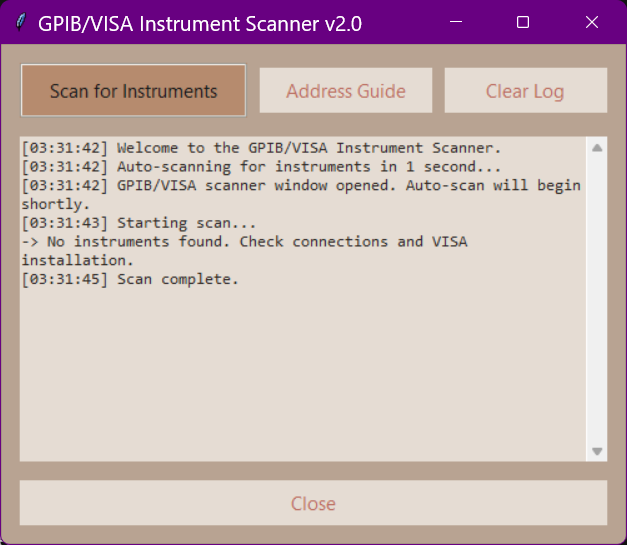
  <br>
  <em>The PICA Instrument Scanner utility, which automatically detects and identifies connected instruments.</em>
</p>

### 5.2 PICA Plotter Utility

*File Reference: `pica/utils/PlotterUtil_GUI.py`*

A standalone, multiprocessing-enabled tool for detailed data analysis. Unlike the minimalist embedded plots in the measurement modules, this utility allows:

  * **Comparative Analysis:** Overlaying multiple `.csv` or `.dat` files.
  * **Live Updates:** Monitoring active experiments by auto-refreshing data from disk.
  * **Flexible Axis Control:** Toggling linear/log scales to analyze data spanning orders of magnitude.

<p align="center">
  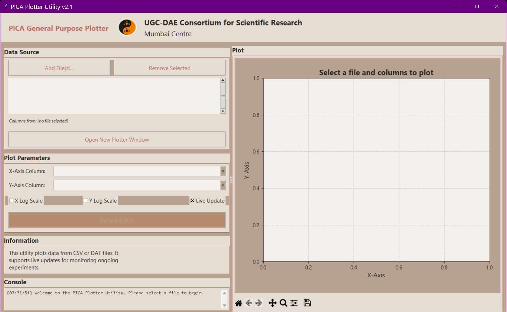
  <br>
  <em>The PICA Plotter Utility, a tool for data visualization and comparative analysis of multiple datasets including live plotting.</em>
</p>

### 5.3 Embedded Document Viewer

To ensure the software is self-contained (useful for offline lab computers), PICA includes an in-app viewer for project documentation, including this User Manual, the Instrument Manuals List, the License, and the Changelog.

### 5.4 Measurement Module Interface

Each measurement module consists of two primary windows: the control window on the left and the plotter window on the right. The dimensions of both windows are resizable. Upon launching a measurement module, it is recommended to first enlarge the control window, as it is required for configuring all experimental parameters. Typical settings include specifying the sample file name, selecting the file storage location, choosing the instrument address via a selection box, and defining voltage and temperature step sizes, delays, and other experimental parameters.

The control window also contains a console located below the parameter settings. This console can be scrolled and provides a continuous log of all operations executed by the software. The right-hand plot window is a simplified plotting interface that can display one, two, or three plots, depending on the specific module. The plots are updated in real time, and some modules allow switching the axes to a logarithmic scale to improve data visualization. The plotting interface is intentionally kept minimalistic, with limited functionality, to reduce unnecessary user interaction with the measurement setup, and maintaining the measurement program in a simplified form by omitting nonessential features.

Above the plot area, there are two buttons providing access to the [VISA Instrument Scanner](#41-visa-instrument-scanner) and [PICA Plotter Utility](#42-pica-plotter-utility). These utilities are accessible from all modules to facilitate rapid testing and diagnostics. The VISA/GPIB scanner allows the user to quickly verify whether instruments are properly connected and recognized by the system, while the plotter utility offers additional plotting capabilities beyond those available in the default plot window.

## 6. Supported Measurement Modules

PICA is designed to be as versatile, while being optimized for specific classes of instruments. The following modules represent the core capabilities of the suite, supporting a resistance scale spanning **24 orders of magnitude** (10 nOhm to 10 POhm) depending on the hardware used.
Pyroelectric measurement performed using an electrometer enables highly sensitive characterization of ferroelectric phase transitions by detecting extremely small pyroelectric currents, with a resolution on the order of 10−15 A. A.The
impedance analyzer enables the characterization of dielectric anomalies over the frequency range from 20 Hz to 2 MHz and is utilized for magnetodielectric and photoinduced characterization across a wide variety of multiferroic systems. 

### 5.1 Low Resistance (Delta Mode)

**Target Hardware:** Keithley 6221 (Current Source) + K2182 (Nanovoltmeter).
**Typical Range:** 10 nOhm to 100 MOhm.

  * **Scientific Objective:** Ideal for superconductors, metallic films, and low-impedance devices. It actively cancels thermal offsets (Seebeck EMFs) generated in leads and contacts.
  * **Principle:** Uses the **AC Delta Method**.
    1.  Source +I, measure V1.
    2.  Source -I, measure V2.
    3.  Compute V\_corr = (V1 - V2) / 2.
        The software synchronizes the source and voltmeter via a **hardware trigger link (RS-232)** for microsecond-level timing.

<p align="center">
  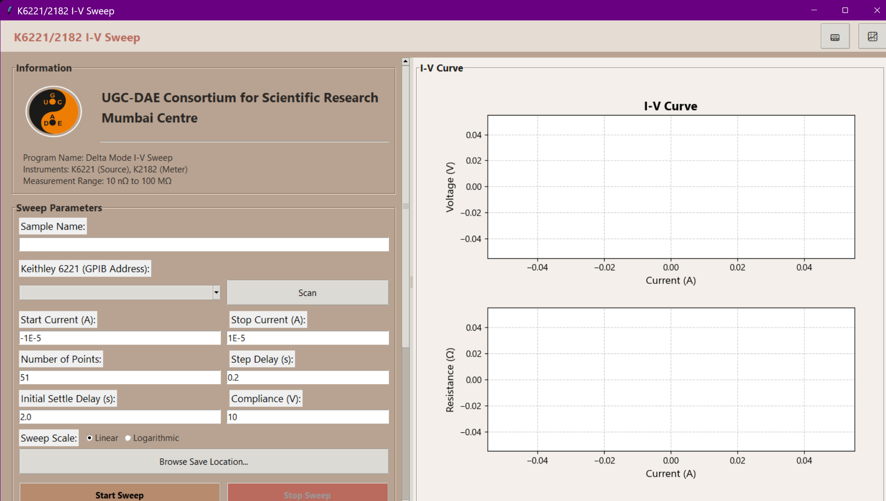
  <br>
  <em>I-V sweep measurement using the Sweep Mode, designed for low-resistance measurements with a Keithley 6221 and 2182.</em>
</p>

### 5.2 General Transport (Standard I-V & R-T)

**Target Hardware:** Keithley 2400 SourceMeter (SMU).
**Typical Range:** 100 µOhm to 200 MOhm.

  * **Scientific Objective:** General transport characterization for semiconductors, oxides, and devices.
  * **Capabilities:**
      * **I-V Sweep:** Linear sweeps, hysteresis loops, or custom current lists.
      * **R-T Active Control:** Applies constant DC current while coordinating with a temperature controller (e.g., Lake Shore 350) to ramp temperature.

<p align="center">
  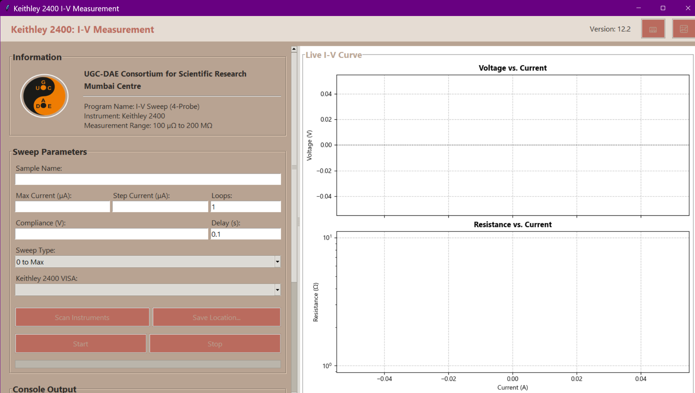
  <br>
  <em>A standard I-V sweep performed with a Keithley 2400 SourceMeter, suitable for general-purpose device and sample characterization.</em>
</p>
<p align="center">
  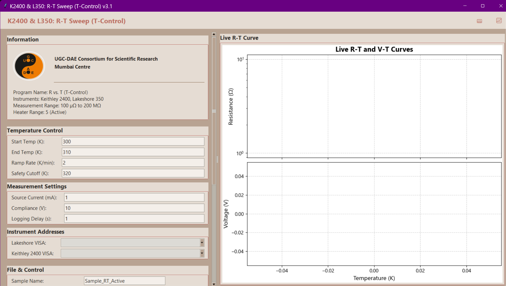
  <br>
  <em>Resistance-Temperature (R-T) measurement with active temperature control, using a Keithley 2400 and a Lakeshore 350 controller.</em>
</p>
<p align="center">
  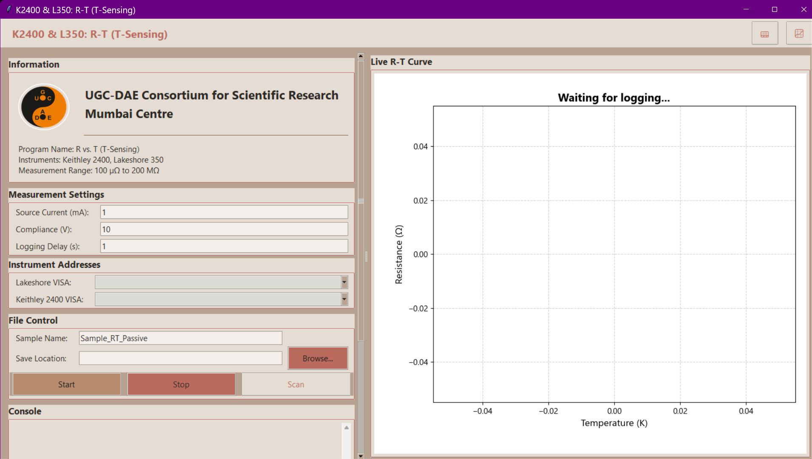
  <br>
  <em>Resistance-Temperature (R-T) measurement in sensing mode, where the system logs resistance and temprature while an external system/controller manages temperature.</em>
</p>

### 5.3 High Precision Transport (mid resistance range)

**Target Hardware:** Keithley 2400 (Source) + K2182 (Nanovoltmeter).
**Typical Range:** 1 µOhm to 100 MOhm.

  * **Scientific Objective:** Detects subtle phase transitions in semiconductors and oxides where standard SMU resolution is insufficient.
  * **Advantage:** Combines the stable sourcing of the SMU with the nanovolt-level sensitivity of a dedicated voltmeter, utilizing a true 4-wire configuration to eliminate lead resistance errors.

<p align="center">
  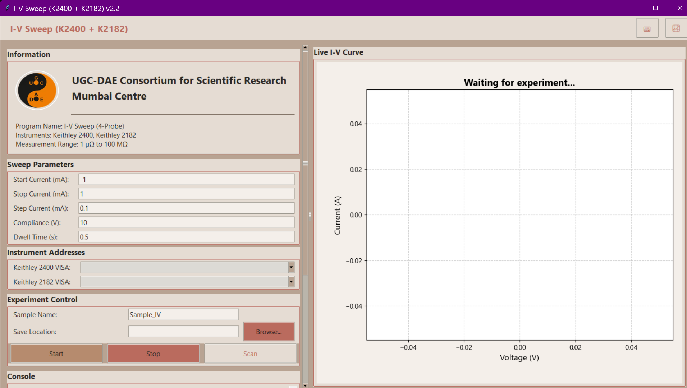
  <br>
  <em>High-precision I-V characterization using a Keithley 2400 as a current source and a Keithley 2182 nanovoltmeter for sensitive mid range resistance measurements.</em>
</p>
<p align="center">
  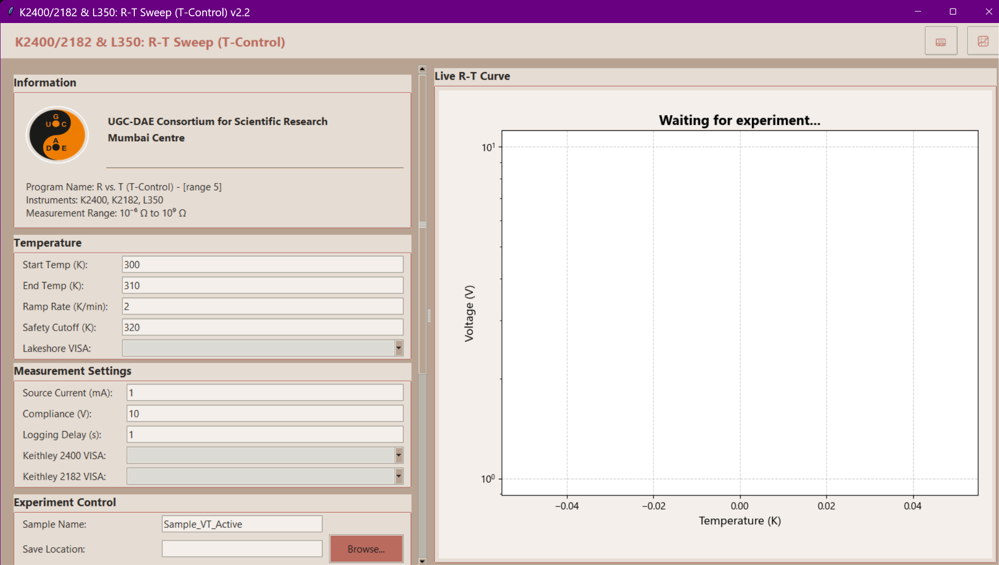
  <br>
  <em>High-precision R-T measurement with active temperature control, combining the K2400, K2182, and a L350 temperature controller.</em>
</p>
<p align="center">
  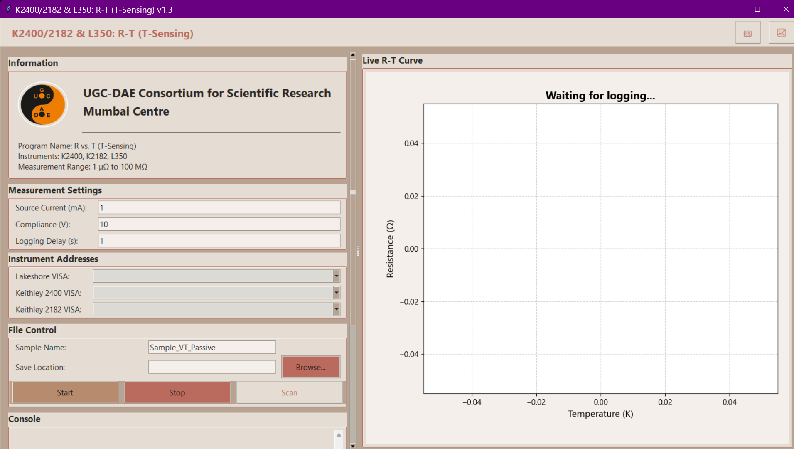
  <br>
  <em>High-precision R-T measurement in sensing mode, leveraging the K2400 and K2182 for enhanced accuracy for mid range resistance measurements.</em>
</p>

### 5.4 Electrometry & High Resistance

**Target Hardware:** Keithley 6517B Electrometer (or compatible High-R meter).
**Typical Range:** 1 Ohm to 10 POhm (10^16 Ohm).

  * **Scientific Objective:** Characterization of dielectrics, polymers, and ceramics (Electrometry).
  * **Principle (Voltage Driven):** Applies a high voltage and measures the resulting leakage current (pA/fA range).
  * **Note:** PICA manages settling times to account for the capacitive nature of high-impedance setups, ensuring steady-state ohmic currents are recorded.

<p align="center">
  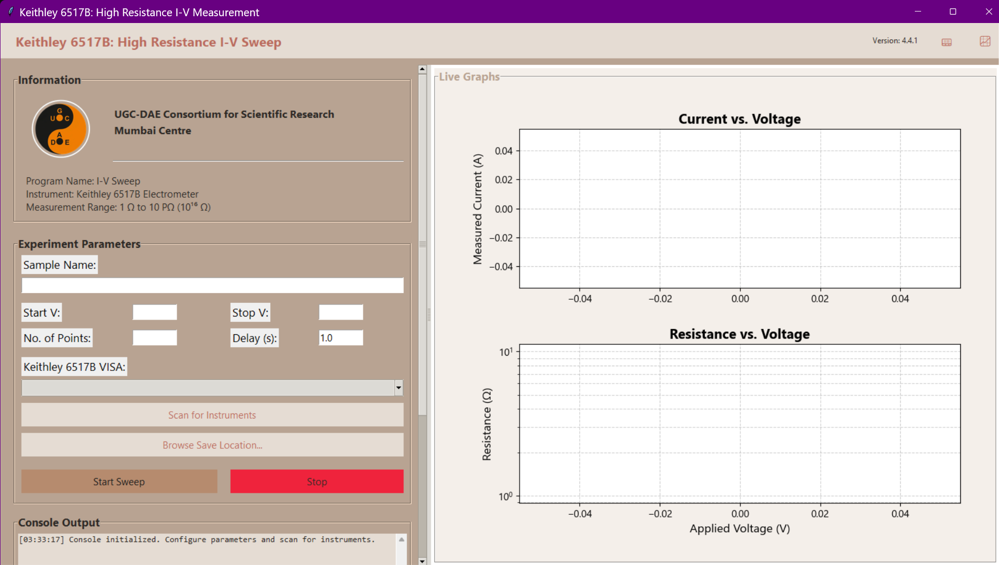
  <br>
  <em>High-resistance I-V measurement performed with a Keithley 6517B Electrometer, designed for characterizing insulating materials.</em>
</p>
<p align="center">
  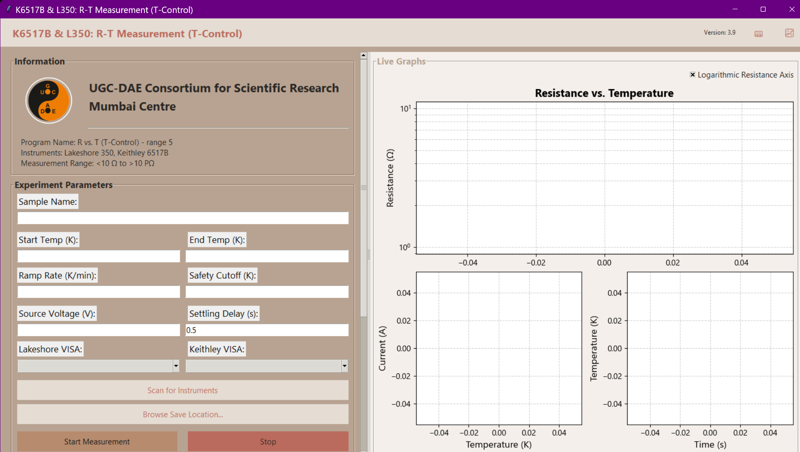
  <br>
  <em>High-resistance R-T measurement with active temperature control using a Keithley 6517B.</em>
</p>
<p align="center">
  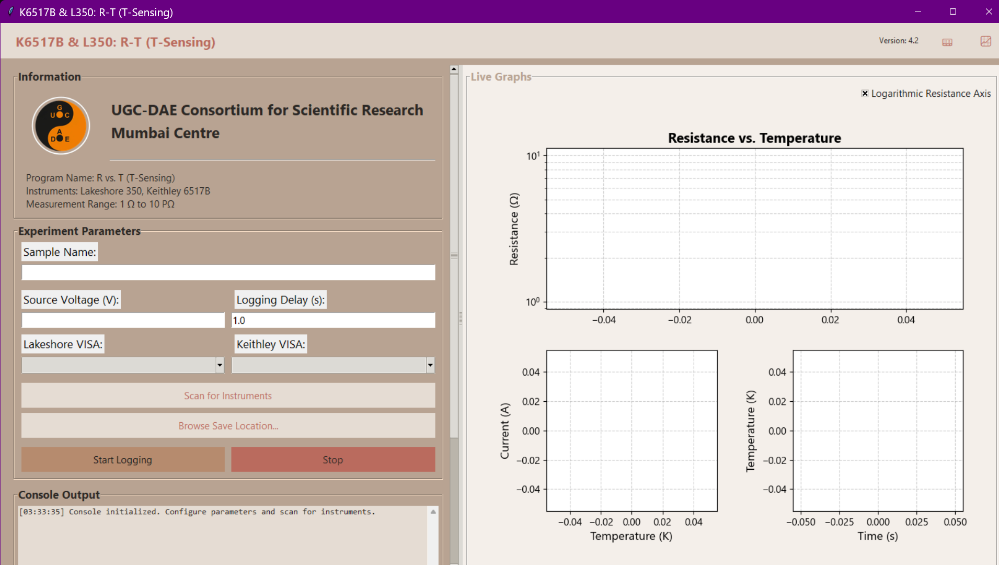
  <br>
  <em>High-resistance R-T measurement in passive sensing mode using a Keithley 6517B.</em>
</p>

### 5.5 Pyroelectric Current Measurements

**Target Hardware:** Keithley 6517B Electrometer + Temperature Controller.
**Sensitivity:** Down to 1 fA (10^-15 A).

This module automates the measurement of pyroelectric currents (Ip) as a function of temperature, commonly used to characterize ferroelectric phase transitions and identify **Curie Temperatures** (Tc).

  * **Workflow:**
    1.  **Poling (Optional):** Apply bias field while cooling.
    2.  **Heating:** Remove bias; heat sample at a linear rate.
    3.  **Measurement:** Record the depolarization current peak indicative of phase transition.
  * **Best Practice:** For measurements in the fA range, ensure your setup utilizes proper shielding (e.g., double-layer Faraday cage).

<p align="center">
  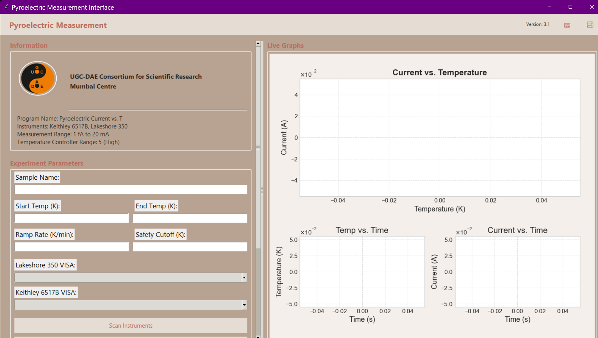
  <br>
  <em>Pyroelectric current measurement as a function of temperature, captured with a Keithley 6517B to identify ferroelectric phase transitions via measuring pyroelectric current.</em>
</p>

### 5.6 High Voltage Poling

**Target Hardware:** Keithley 6517B (Voltage Source).
**Capabilities:** High Voltage Sourcing.

This utility provides a dedicated interface for **In-situ and ex-situ electrical poling** of materials.

  * **Objective:** Establish a uniform ferroelectric polarization state in samples before characterization.
  * **Applications:** Preparing samples for pyroelectric current measurements, converse magnetoelectric studies, and ex-situ neutron diffraction studies on poled materials.

### 5.7 Dielectric Spectroscopy

**Target Hardware:** Keysight E4980A Precision LCR Meter.
**Frequency Range:** 20 Hz to 2 MHz
  * **Temperature Range:** 5 K – 380 K

  *   **Scientific Objective:** Measures Capacitance (C) and Loss Tangent (tan delta) as a function of frequency or DC bias voltage (C-V Analysis).

  

  <p align="center">
  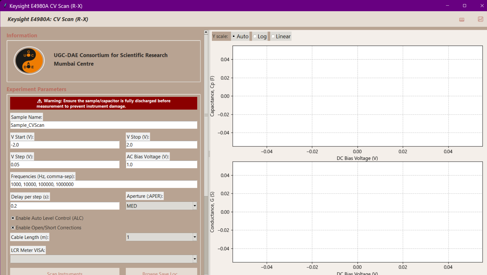
  <br>
  <em>Capacitance-Voltage (C-V) characterization of a device or a sample using a Keysight E4980A LCR meter.</em>
</p>

### 5.8 Standalone Temperature Utilities

**Target Hardware:** Lake Shore 350 Temperature Controller.

PICA also includes standalone utilities for monitoring and controlling temperature, independent of other measurement modules.

  * **Temperature Monitor:** A simple interface for logging temperature from multiple types of sensors.
  * **Temperature Control:** A dedicated module for setting temperature ramps, controlling heater outputs, and managing control loops.

<p align="center">
  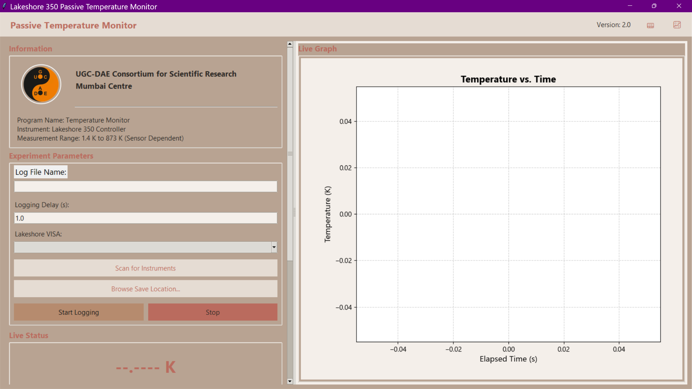
  <br>
  <em>The standalone Temperature Monitor utility, used for logging data from a Lakeshore 350 controller.</em>
</p>
<p align="center">
  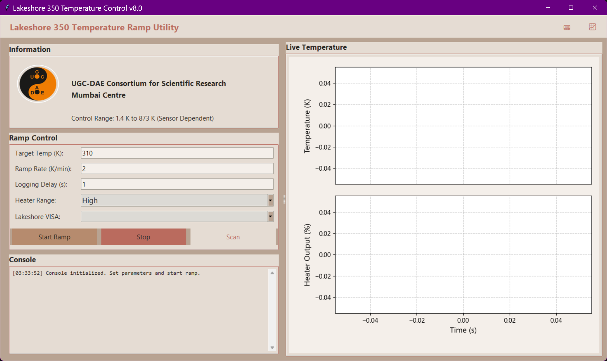
  <br>
  <em>The standalone Temperature Control utility, providing a dedicated interface for managing temperature ramps and heater outputs on a Lakeshore 350.</em>
</p>

## 6. Common Issues & Troubleshooting

This section covers the most common issues encountered when using PICA.

### 6.1 VISA Timeout Error or Resource Not Found

This is the most frequent issue and usually indicates a problem with the connection between the computer and the instrument. Follow these steps to resolve it:

1.  **Check Physical Connections:** Ensure all cables (GPIB, USB, Ethernet) are securely connected to both the instrument and the computer.
2.  **Use the VISA Scanner:** Run the **VISA Instrument Scanner** utility from the PICA launcher.
    *   If the instrument appears in the list, the connection is working. Note the correct VISA address.
    *   If the instrument does **not** appear, PICA cannot see it. Proceed to the next steps.
3.  **Power Cycle the Instrument:** Turn the instrument off, wait a few seconds, and turn it back on. This can often resolve temporary communication hangs.
4.  **Restart the Computer:** If the problem persists, a full restart can resolve driver or backend issues.
    *   Shut down the computer completely, leaving the instrument turned off.
    *   Start the computer.
    *   Once the system is fully booted, run the PICA VISA scanner.
    *   Turn on the instrument.
5.  **Check Drivers and Communication Mode:**
    *   Ensure you have the correct VISA backend installed (see the `A VISA Backend is Required` warning in the [Installation & Setup](#3-installation--setup) section).
    *   If using a different communication interface (e.g., switching from GPIB to USB), verify that the necessary drivers are installed and that the instrument is configured for that mode.

## 7. Technical Reference

### 7.1 File Naming Convention

To ensure data integrity and easy sorting, PICA automatically generates filenames using a standardized format. This allows for easier parsing by external analysis tools.
Format: `[SampleName]_[Timestamp]_[Identifier].dat`
Example: `SampleA_2025-12-04_1430_IV_Sweep.dat`

### 7.2 GPIB Address Guide

PICA uses standard VISA resource strings. While the defaults below are common, users should verify their specific instrument addresses using the built-in **Instrument Scanner** or front-panel settings.

  * **Lake Shore 350:** `GPIB1::15::INSTR`
  * **Keithley 2400:** `GPIB1::4::INSTR`
  * **Keithley 6221:** `GPIB0::13::INSTR`
  * **Keithley 2182:** `GPIB0::7::INSTR`
  * **Keithley 6517B:** `GPIB1::27::INSTR`
  * **Keysight E4980A:** `GPIB0::17::INSTR`
  * **SRS SR830:** `GPIB0::8::INSTR`

## 8. Citation & Funding

**Collaborative Ecosystem:**
PICA is open-source (MIT License) to foster transparency. By providing the source code, the measurement protocols become auditable, ensuring that experimental conditions are reproducible and not hidden behind a proprietary "black box." We encourage other research groups to adapt these scripts for their specific hardware configurations.

**Citation:**

```bibtex
@software{Deshmukh_PICA_2025,
  author       = {Deshmukh, Prathamesh Keshao and Mukherjee, Sudip},
  title        = {{PICA: Python-based Instrument Control and Automation Software Suite}},
  year         = 2025,
  publisher    = {GitHub},
  version      = {1.0.0},
  url          = {https://github.com/prathameshnium/PICA-Python-Instrument-Control-and-Automation}
}
```

## 9. Future Development

### 9.1 AC Resistivity (Lock-In)

*Status: Under Development*

  * **Instruments:** Keithley 6221 (AC Source) + SRS SR830 (DSP Lock-In Amplifier).
  * **Resistance Range:** \~ 20 nOhm to 1 MOhm.
  * **Scientific Objective:** Probes frequency-dependent transport phenomena.
  * **Use Case:** Useful for distinguishing between different conduction mechanisms by analyzing the frequency response of the sample's resistance.
  * **Workflow:** The Keithley 6221 provides a precise AC excitation current, while the Lock-In Amplifier (SR830) extracts the signal amplitude and phase with high noise rejection, allowing for measurements in high-noise environments.

### 9.2 Standalone Executables

In the future, We also plan to develop executable (`.exe`) versions of the PICA software suite. This will remove the need for users to manage Python environments and dependencies, further simplifying the setup process and facilitating rapid adoption in laboratories with strict IT policies or offline computers.


## 10. Authors & Acknowledgments
<p align="center">
  
</p>
- **Lead Developer:** [**Prathamesh Deshmukh**](https://www.researchgate.net/profile/Prathamesh-Deshmukh-6)
- **Principal Investigator:** [**Dr. Sudip Mukherjee**](https://www.csr.res.in/Faculty/profile/889/893/Dr.SudipMukherjee)
- **Affiliation:** [*UGC-DAE Consortium for Scientific Research, Mumbai Centre*](https://www.csr.res.in/Mumbai_Centre)

**Funding:**
Financial support for this work was provided under SERB-CRG project grant No. CRG/2022/005676 from the Anusandhan National Research Foundation (ANRF).

## 11. License

This project is licensed under the MIT License - see the LICENSE file for details.
## 12. Appendix A: Project File Structure

For developers and advanced users, the following reference outlines the PICA directory structure (v1.0.0).

> [!NOTE]
> Adding a new module to the main launcher into the GUI requires modifying `pica/main.py`.

```text
PICA (Root Directory)/
    .coveragerc
    .gitignore
    CHANGELOG.md
    CITATION.cff
    CODE_OF_CONDUCT.md
    CONTRIBUTING.md
    LICENSE
    README.md
    path.py
    pica_cli.py
    pyproject.toml
    requirements.txt
    run_pica.py
    .github/
        workflows/
            build_pdf.yml
            codeql.yml
            joss_tests.yml
            python-app.yml
    docs/
        Ranges_for_Measurements.md
        User_Manual.md
    paper/
        paper.bib
        paper.md
    pica/
        __init__.py
        cli.py
        main.py
        assets/                 <-- Images, Logos
        keithley/
            delta_mode/         <-- Low Resistance (K6221 + K2182)
                Delta_RT_K6221_K2182_L350_Sensing_GUI.py
                Delta_RT_K6221_K2182_L350_T_Control_GUI.py
                IV_K6221_DC_Sweep_GUI.py
            k2400/              <-- Mid Resistance (K2400 Standard)
                IV_K2400_GUI.py
                RT_K2400_L350_T_Control_GUI.py
                RT_K2400_L350_T_Sensing_GUI.py
            k2400_2182/         <-- Mid Resistance (High Precision)
                IV_K2400_K2182_GUI.py
                RT_K2400_K2182_T_Control_GUI.py
            k6517b/             <-- High Resistance & Pyroelectric
                High_Resistance/
                    IV_K6517B_GUI.py
                    RT_K6517B_L350_T_Control_GUI.py
                Pyroelectricity/
                    Pyroelectric_K6517B_L350_GUI.py
        keysight/               <-- Dielectric (E4980A)
            CV_KE4980A_GUI.py
        lakeshore/              <-- Temperature Control
            T_Control_L350_RangeControl_GUI.py
            T_Sensing_L350_GUI.py
        lockin/                 <-- Lock-in Amplifiers (Experimental)
            BasicTest_S830_Instrument_Control.py
        utils/                  <-- Core Utilities
            GPIB_Instrument_Scanner_GUI.py
            PlotterUtil_GUI.py
    tests/                      <-- Automated Test Suite
```